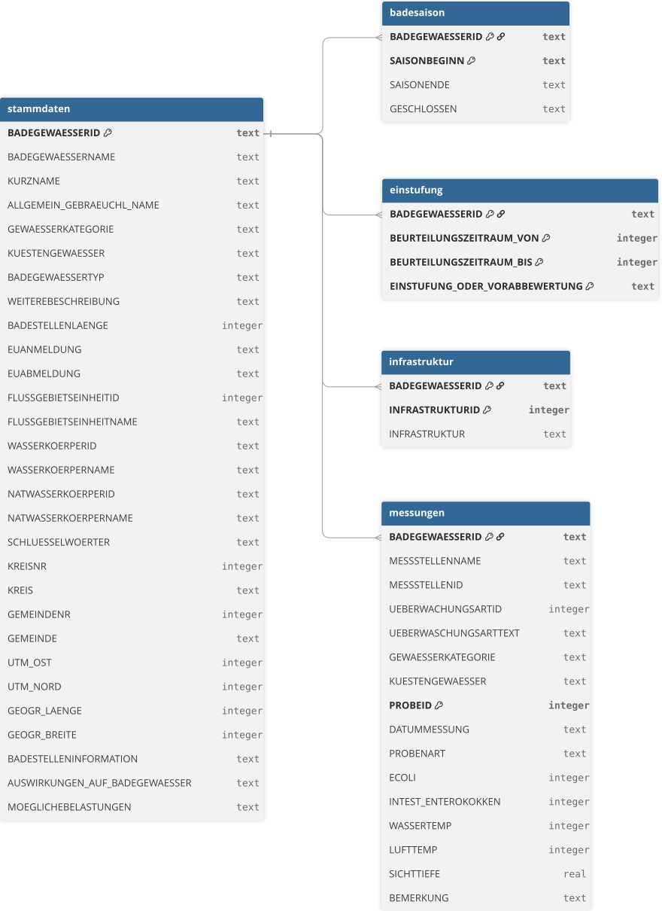
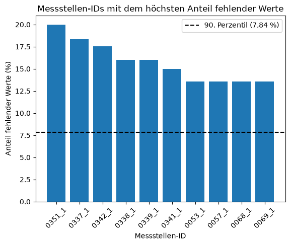

# Badegewässer – Data Quality Analysis

Analyse der Datenqualität von Badegewässerdaten aus Schleswig-Holstein mit SQL und Python.

## Fragestellung

Wie lässt sich die Qualität der vorliegenden Badegewässerdaten anhand von Vollständigkeit, Konsistenz, referentieller Integrität und Plausibilität systematisch überprüfen?

Ziel des Projekts ist es, typische Datenqualitätsprobleme zu identifizieren, nachvollziehbar zu dokumentieren und die Ergebnisse reproduzierbar auszuwerten.

## Datensatz

Für die Analyse wurden öffentlich bereitgestellte Daten zu Badegewässern in Schleswig-Holstein verwendet.

Der Datensatz umfasst mehrere miteinander verknüpfte Tabellen:

- `stammdaten` – Stammdaten der Badegewässer
- `badesaison` – Angaben zu den Badesaisons
- `einstufung` – Einstufungen bzw. Vorabbewertungen
- `infrastruktur` – Angaben zur vorhandenen Infrastruktur
- `messungen` – Messungen und Messwerte

## Quellen

GovData: Badegewässer - Einstufung https://www.govdata.de/suche/daten/badegewasser-einstufung78c89
GovData: Badegewässer - Infrastruktur https://www.govdata.de/suche/daten/badegewasser-infrastruktur
GovData: Badegewässer - Messungen https://www.govdata.de/suche/daten/badegewasser-messungen79f84
GovData: Badegewässer - Saisondauer https://www.govdata.de/suche/daten/badegewasser-saisondauer
GovData: Badegewässer - Stammdaten https://www.govdata.de/suche/daten/badegewasser-stammdaten6e34f

Abrufdatum: 25.09.2026

## Datenmodell

Die Tabellen wurden anhand der vorliegenden Daten auf mögliche Primary Keys untersucht.

Verwendete Primärschlüssel:

| Tabelle       | Primärschlüssel                                                                                        |
|---------------|--------------------------------------------------------------------------------------------------------|
| stammdaten    | BADEGEWAESSERID                                                                                        |
| badesaison    | BADEGEWAESSERID + SAISONBEGINN                                                                         |
| einstufung    | BADEGEWAESSERID + BEURTEILUNGSZEITRAUM_VON + BEURTEILUNGSZEITRAUM_BIS + EINSTUFUNG_ODER_VORABBEWERTUNG |
| infrastruktur | BADEGEWAESSERID + INFRASTRUKTURID                                                                      |
| messungen     | BADEGEWAESSERID + PROBEID                                                                              |

Die Beziehungen zwischen den Tabellen wurden über `BADEGEWAESSERID` modelliert. `stammdaten` bildet dabei die zentrale Tabelle, auf die die übrigen Tabellen über `BADEGEWAESSERID` verweisen.

## Methodik der Datenqualitätsprüfung

Die Daten wurden in fünf Bereichen untersucht:

1. Datenmodell und Primärschlüssel
2. Referentielle Integrität
3. Vollständigkeit
4. Konsistenz
5. Plausibilität

### 1. Datenmodell und Primärschlüssel

Für die angenommenen Primärschlüssel wurde geprüft, ob identische Schlüssel mehrfach vorkommen.

### 2. Referentielle Integrität

Für die Tabellen `badesaison`, `einstufung`, `infrastruktur` und `messungen` wurde geprüft, ob die verwendeten `BADEGEWAESSERID` in `stammdaten` vorhanden sind.

### 3. Vollständigkeit

Bei den Messdaten wurde insbesondere untersucht, ob Messstelleninformationen, Messzeitpunkte und die einzelnen Messparameter vorhanden sind.

Um Messstellen mit vergleichsweise hohen Fehlwertanteilen zu identifizieren, wurde für jede Messstelle der Anteil fehlender Werte über die fünf Messparameter `ECOLI`, `INTEST_ENTEROKOKKEN`, `WASSERTEMP`, `LUFTTEMP` und `SICHTTIEFE` berechnet. Als relativer Schwellenwert wurde das 90. Perzentil der Fehlwertanteile aller Messstellen verwendet. 

### 4. Konsistenz

Es wurden verschiedene Beziehungen zwischen inhaltlich zusammengehörigen Feldern überprüft.

Unter anderem wurde untersucht:

- ob Küstengewässer ohne entsprechende Angabe in `KUESTENGEWAESSER` vorkommen,
- ob eine `MESSSTELLENID` mehreren unterschiedlichen Messstellennamen zugeordnet ist,
- ob eine `UEBERWACHUNGSARTID` mehreren unterschiedlichen Überwachungsarttexten zugeordnet ist.

### 5. Plausibilität

Für ausgewählte Messwerte wurden Plausibilitätsgrenzen als Annahmen zur Prüfung definiert und auf Ausreißer geprüft.

Die verwendeten Grenzen:

| Messwert         | geprüfter Bereich |
|------------------|------------------ |
| Wassertemperatur | −5 bis 30 °C      |
| Lufttemperatur   | −10 bis 40 °C     |
| Sichttiefe       | 0 bis 10 m        |

Zusätzlich wurde das Format von `DATUMMESSUNG` als `TT.MM.JJJJ` sowie der Wertebereich von Tag und Monat geprüft.

## Ergebnisse

In der folgenden Tabelle sind alle Ergebnisse der Datenqualitätsprüfung zusammengefasst.

| Dimension                | Prüfung                                                    | Ergebnis                                |
|------------------------- |----------------------------------------------------------- |---------------------------------------- |
| Referentielle Integrität | `BADEGEWAESSERID` in abhängigen Tabellen in `stammdaten`   | 27 unterschiedliche IDs nicht vorhanden |
| Vollständigkeit          | Fehlende `EINSTUFUNG_ODER_VORABBEWERTUNG`                  | 2                                       |
| Vollständigkeit          | Fehlende `ECOLI`-Werte                                     | 11                                      |
| Vollständigkeit          | Fehlende `INTEST_ENTEROKOKKEN`-Werte                       | 15                                      |
| Vollständigkeit          | Fehlende `WASSERTEMP`-Werte                                | 421                                     |
| Vollständigkeit          | Fehlende `LUFTTEMP`-Werte                                  | 25                                      |
| Vollständigkeit          | Fehlende `SICHTTIEFE`-Werte                                | 2.315                                   |
| Vollständigkeit          | Messungen ohne einen der fünf Messwerte                    | 1                                       |
| Vollständigkeit          | 90. Perzentil des Fehlwertanteils je Messstelle            | 7,84 %                                  |
| Konsistenz               | Küstengewässer ohne Angabe in `KUESTENGEWAESSER`           | 0                                       |
| Konsistenz               | `MESSSTELLENID` mit mehreren unterschiedlichen Namen       | 0                                       |
| Konsistenz               | Messstellennamen mit mehreren unterschiedlichen IDs        | 9                                       |
| Konsistenz               | `UEBERWACHUNGSARTID` mit mehreren unterschiedlichen Texten | 0                                       |
| Konsistenz               | `UEBERWACHUNGSARTTEXT` mit mehreren unterschiedlichen IDs  | 0                                       |
| Plausibilität            | `WASSERTEMP` außerhalb −5 bis 30 °C                        | 3 Werte                                 |
| Plausibilität            | `LUFTTEMP` außerhalb −10 bis 40 °C                         | 6 Werte                                 |
| Plausibilität            | `SICHTTIEFE` außerhalb 0 bis 10 m                          | 10 Werte                                |
| Plausibilität            | Negative `ECOLI`-Werte                                     | 0                                       |
| Plausibilität            | Negative `INTEST_ENTEROKOKKEN`-Werte                       | 0                                       |
| Plausibilität            | Geprüftes Datumsformat bzw. Wertebereich                   | keine Auffälligkeiten                   |

> **Hinweis zur referentiellen Integrität:** Die 27 unterschiedlichen `BADEGEWAESSERID` treten in mindestens einer abhängigen Tabelle auf, sind jedoch nicht in `stammdaten` vorhanden. Die Ursache dieser Abweichung konnte anhand der verfügbaren Datensatzbeschreibung nicht eindeutig bestimmt werden.

> **Hinweis zum Fehlwertanteil:** Zur Identifikation von Messstellen mit vergleichsweise hohen Fehlwertanteilen wurde das 90. Perzentil über alle Messstellen bestimmt. Der Schwellenwert liegt bei 7,84 %. 36 Messstellen liegen oberhalb dieses Schwellenwerts.

Die Ergebnisse der Fehlwertanalyse wurden zusätzlich grafisch dargestellt. 

### 1. Ergebnisse der Datenqualitätsprüfung

Für alle fünf Tabellen wurden keine doppelten Schlüssel gefunden.

Bei `einstufung` wurden außerdem zwei Datensätze mit einem fehlenden Wert in `EINSTUFUNG_ODER_VORABBEWERTUNG` festgestellt. Die übrigen Bestandteile des angenommenen zusammengesetzten Primärschlüssels sind vorhanden.

### 2. Ergebnisse Prüfung referentielle Integrität

Insgesamt wurden 27 unterschiedliche `BADEGEWAESSERID` identifiziert, die in mindestens einer abhängigen Tabelle verwendet werden, aber nicht in `stammdaten` vorhanden sind.

Die IDs treten dabei nicht in allen abhängigen Tabellen auf:

- `badesaison`: 26
- `einstufung`: 27
- `infrastruktur`: 22
- `messungen`: 19

Die Ursache dieser Abweichung konnte anhand der verfügbaren Datensatzbeschreibung nicht eindeutig bestimmt werden.

Die Ergebnisse wurden zusätzlich tabellenübergreifend in einer separaten CSV-Datei dokumentiert:

[`data_quality/referentielle_integritaet.csv`](data_quality/referentielle_integritaet.csv)

### 3. Ergebnisse Prüfung auf Vollständigkeit

Die meisten geprüften Identifikations- und Datumsfelder sind vollständig. Bei den Messparametern treten jedoch fehlende Werte auf.

Besonders häufig fehlen Werte bei `SICHTTIEFE` und `WASSERTEMP`.

Das 90. Perzentil der Fehlwertanteile aller `MESSSTELLENID` liegt bei 7,84 %. Der maximale Fehlwertanteil liegt bei 20 %. Diese Analyse dient der Identifikation von Messstellen mit vergleichsweise hoher Datenlückenrate. Ein hoher Anteil fehlender Werte stellt eine Auffälligkeit der Datenvollständigkeit dar, wird aber nicht als fachlicher Fehler interpretiert.

### 4. Ergebnisse der Prüfung auf Konsistenz

Für eine `MESSSTELLENID` wurde jeweils nur ein Messstellenname festgestellt.

Umgekehrt werden 9 Messstellennamen mehreren unterschiedlichen `MESSSTELLENID` zugeordnet. Dies muss nicht automatisch als Datenfehler interpretiert werden, da anhand der verfügbaren Datensatzbeschreibung nicht festgestellt werden konnte, dass ein Messstellenname eindeutig sein muss.

Bei den übrigen geprüften Konsistenzbeziehungen wurden keine Auffälligkeiten festgestellt.

### 5. Ergebnisse der Prüfung auf Plausibilität

Es wurden folgende auffällige Werte gefunden:

- `WASSERTEMP`: 3 Werte außerhalb des geprüften Bereichs
- `LUFTTEMP`: 6 Werte außerhalb des geprüften Bereichs
- `SICHTTIEFE`: 10 Werte außerhalb des geprüften Bereichs
- negative `ECOLI`-Werte: keine
- negative `INTEST_ENTEROKOKKEN`-Werte: keine

Bei der Überprüfung des Datumsformats wurden keine Auffälligkeiten festgestellt.

## Fazit

Die Analyse zeigt, dass die Badegewässerdaten insgesamt eine strukturierte und über mehrere Tabellen verknüpfte Datenbasis bilden, zugleich aber verschiedene Datenqualitätsauffälligkeiten enthalten.

Besonders relevant sind fehlende Messwerte bei einzelnen Messparametern sowie 27 unterschiedliche `BADEGEWAESSERID`, die in mindestens einer abhängigen Tabelle vorkommen, jedoch keinen entsprechenden Eintrag in `stammdaten` besitzen. Darüber hinaus wurden einzelne Messwerte identifiziert, die außerhalb der für diese Analyse definierten Plausibilitätsbereiche liegen.

Nicht jede Auffälligkeit stellt dabei automatisch einen Datenfehler dar. Insbesondere bei den unterschiedlichen Messstellennamen und bei den nicht zuordenbaren `BADEGEWAESSERID` konnte anhand der verfügbaren Datensatzbeschreibung keine eindeutige Ursache festgestellt werden. Die Ergebnisse sind daher als dokumentierte Datenqualitätsbefunde und nicht als abschließende fachliche Bewertung der Daten zu verstehen.

Das Projekt zeigt beispielhaft, wie sich mit SQL und Python Datenstrukturen untersuchen, Datenqualitätsregeln formulieren, Auffälligkeiten systematisch identifizieren und Ergebnisse reproduzierbar dokumentieren lassen.

## Projektstruktur

- sql/ – SQL-Abfragen
- python/ – Python-Analyse und Visualisierung
- schema/ – Datenbankschema
- images/ – Visualisierungen und Schema-Grafik

Verwendete Technologien: SQLite, SQL, Python, Pandas, Matplotlib, dbdiagram.io

